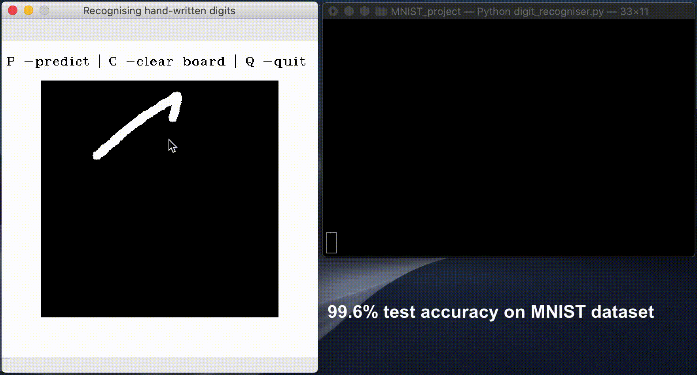

# Handwritten-digit-recogniser
A machine learning program that lets you draw a digit and recognises it with high accuracy. This uses Convolutional Neural Networks.



# Installation requirements
- Python 3.X
- Tensorflow 2.0 or higher
- OpenCV
- Numpy

To run it on your local machine, download the two files into the same folder. Run "model.py" to train the model and then "digit_recogniser.py" to start the program.
```bash
python3 digit_recogniser.py
```
